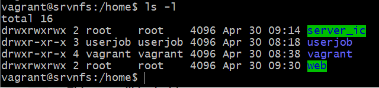

# TP LINUX - GROUPE 1

## Installation des serveurs

### Installation serveur NFS
**LE SERVEUR NFS DOIT ETRE IMPERATIVEMENT DEMARRE AVANT LES SERVEURS WEB ET JENKINS (INTEGRATION CONTINUE)**
* ouvrir un terminal à partir du dossier contenant l'ensemble des scripts et le Vagrantfile
* taper "vagrant up srvnfs"
* attendre la fin de l'installation
* taper "vagrant ssh srvnfs" pour se connecter au serveur NFS
* Attendu : "vagrant@srvnfs:~$" en prompt

### Installation serveur web
**LE SERVEUR WEB DOIT ETRE IMPERATIVEMENT DEMARRE AVANT LES SERVEURS DE DEV**
* ouvrir un terminal à partir du dossier contenant l'ensemble des scripts et le Vagrantfile
* taper "vagrant up srvweb"
* attendre la fin de l'installation
* taper "vagrant ssh srvweb" pour se connecter au serveur web
* Attendu : "vagrant@srvweb:~$" en prompt 

### Installation serveur Jenkins
**LE SERVEUR JENKINS DOIT ETRE IMPERATIVEMENT DEMARRE AVANT LES SERVEURS DE DEV**
* ouvrir un terminal à partir du dossier contenant l'ensemble des scripts et le Vagrantfile
* taper "vagrant up srvjenkins"
* attendre la fin de l'installation
* récupérer/noter le mot de passe de Jenkins renvoyé en fin de logs du vagrant up (cf image)

* taper "vagrant ssh srvjenkins" pour se connecter au serveur Jenkins
* Attendu : "vagrant@srvjenkins:~$" en prompt

### Installation des serveurs de dev
* ouvrir trois terminaux à partir du dossier contenant l'ensemble des scripts et le Vagrantfile
* taper "vagrant up srvdev1" dans le premier terminal
* taper "vagrant up srvdev2" dans le deuxième terminal
* taper "vagrant up srvdev3" dans le troisième terminal
* attendre la fin de l'installation
* taper "vagrant ssh srvdev1" pour se connecter au serveur dev1
* taper "vagrant ssh srvdev2" pour se connecter au serveur dev2
* taper "vagrant ssh srvdev3" pour se connecter au serveur dev3
* Attendu : "vagrant@srvdev1:~$" en prompt du premier terminal
* Attendu : "vagrant@srvdev2:~$" en prompt du deuxième terminal
* Attendu : "vagrant@srvdev3:~$" en prompt du troisième terminal

## Vérifications des installations

### Pour le serveur NFS
Vérification des répertoires partagés avec les serveurs web et jenkins
  * taper cd /home/web : on doit accéder au dossier, càd avoir un prompt qui indique "vagrant@srvnfs:/home/web$"
  * taper ls -l : on doit avoir un fichier index.html présent
  * taper cd /home/server_ic : on doit accéder au dossier, càd avoir un prompt qui indique "vagrant@srvnfs:/home/server_ic$"
  * taper cd /home : on doit accéder au dossier, càd avoir un prompt qui indique "vagrant@srvnfs:/home$"
  * taper ls -l : on vérifie que tous les utilisateurs ont tous les droits sur les deux dossiers web et server_ic (cf image)
  
  
  * si tous les utilisateurs n'ont pas tous les droits taper la commande suivante, de sorte à pouvoir tester le serveur web et le serveur Jenkins à 100% : "sudo chmod 777 web server_ic"
  
### Pour le serveur web
1. Vérification du répertoire partagé avec le serveur NFS
  * taper "cd /var/www/html" : on doit accéder au dossier, càd avoir un prompt qui indique "vagrant@srvweb:/var/www/html$"
  * taper ls -l : on doit avoir un fichier index.html présent
  * taper touch testWeb.txt : il ne doit pas y avoir de message d'erreur
  * taper ls -l : il y a maintenant deux fichiers présents : index.html et testWeb.txt
2. Vérification d'accès au index.html depuis un navigateur web avec l'url
  * ouvrir VirtualBox en double cliquant sur l'icône (cf image)
  
  
  * sélectionner la vm du serverweb dans la colonne de gauche puis cliquer sur Configuration (cf image)
  
  
  * sélectionner "Réseau" dans le menu de gauche puis cliquer sur "Avancé" puis sur "Redirection de ports" (cf image)
  
  
  * ajouter une ligne à l'aide du "plus" vert sur la droite et la remplir telle que présenté sur l'image
  
  
  * ouvrir votre navigateur web préféré
  * placez-vous dans la barre d'url (tout en haut)
  * tapez l'url suivante 127.0.0.1:80 puis validez.
  * une page s'ouvre alors avec le contenu du fichier index.html (cf image)
  
  
  
3. Vérification installation apache
  * revenir sur le terminal du srvweb
  * taper dans l'invite de commande "ps -ef | grep apache". La réponse doit être comme sur l'image suivante
  
  
  
4. Vérification firewalls
  * taper dans l'invite de commande "sudo ufw status verbose"
  * La réponse doit être comme dans l'image suivante. la mention "Status : active" doit être présente
  
  
  
### Pour le serveur jenkins
1. Vérification du répertoire partagé avec le serveur NFS
  * taper "cd /usr/local/jenkins" : on doit accéder au dossier, càd avoir un prompt qui indique "vagrant@srvjenkins:/usr/local/jenkins$"
  * taper touch testJenkins.txt : il ne doit pas y avoir de message d'erreur (s'il y a une erreur il faut revenir aux étapes de vérification sur le serveur NFS)
  * taper ls -l : il y a maintenant un fichier présent : testJenkins.txt
2. Vérification firewalls
  * taper dans l'invite de commande "sudo ufw status verbose"
  * La réponse doit être comme dans l'image suivante. 
  
  
3. Vérification d'accès au jenkins depuis un navigateur web avec l'url
  * ouvrir VirtualBox en double cliquant sur l'icône (cf image)
  
  
  * sélectionner la vm du serverjenkins dans la colonne de gauche puis cliquer sur Configuration (cf image)
  
  
  * sélectionner "Réseau" dans le menu de gauche puis cliquer sur "Avancé" puis sur "Redirection de ports" (cf image)
  
  
  * ajouter une ligne à l'aide du "plus" vert sur la droite et la remplir telle que présenté sur l'image
  
  
  * ouvrir votre navigateur web préféré
  * placez-vous dans la barre d'url (tout en haut)
  * tapez l'url suivante 127.0.0.1:8080 puis validez.
  * une page s'ouvre alors avec la page d'authentification de jenkins (cf image)
  
  
  * utiliser la valeur relevée à la fin de l'étape de vagrant up dans l'installation du serveur jenkins comme mot de passe pour s'identifier.
  * on arrive sur la page d'accueil de jenkins (cf image)
  
  
  
### Pour le serveur dev
1. Vérifier la connexion ssh vers les serveurs jenkins et web
  * taper la commande "sudo su - userjob" pour se connecter au user userjob.
  * le prompt devient "userjob@srvdev1:~$"
  * taper "ssh 192.168.0.29" pour se connecter sur le serveur web
  * le prompt devient "userjob@srvweb:~$"
  * taper exit et entrée pour se déconnecter du serveur web
  * taper "ssh 192.168.0.30" pour se connecter sur le serveur jenkins
  * le prompt devient "userjob@srvjenkins:~$"
  * taper exit et entrée pour se déconnecter du serveur jenkins
  * taper exit et entrée pour se déconnecter du user userjob
2. Vérifier les installations
  * taper "vagrant --version" pour vérifier l'installation de vagrant
  * réponse attendue "Vagrant 2.2.16"
  * taper cd 
  * taper ls -l
  * un dossier example-python doit être présent, ce qui signifie que git est bien installé
  * taper cd example-python/vagrant
  * taper python3 main.py
  * réponse attendue : "Bien joué votre VM avec python fonctionne" ce qui signifie que le git clone s'est bien passé et que python 3 est correctement installé.

### Pour le script d'utilitaire corbeille
1. Récupérer le script
  * ouvrir le fichier corbeille.sh dans un notepad++ (ou autre éditeur de code) et copier le contenu
  * aller dans le terminal du srvdev1
  * taper "cd" et entrée
  * taper "vi corbeille.sh" et entrée pour valider. Ceci ouvre un éditeur vim
  * taper "i" pour passer en mode insertion puis coller le code avec "Maj + Inser" (sur nos pc "Maj + Fn + F12")
  * taper "Echap" puis ":wq!" et entrée pour quitter l'éditeur et sauvegarder les modifications.
  * taper "sudo chmod +x corbeille.sh" pour pouvoir exécuter le script
2. Tester le script
  * taper "bash corbeille.sh" : un message d'erreur et le manuel d'utilisation doivent apparaître
  * taper "bash corbeille.sh HELP" : le manuel d'aide doit appaître
  * taper "bash corbeille.sh TRASH" : un message signifiant que le dossier TRASH n'existe pas et est donc vide doit apparaître
  * taper "touch toto.txt" pour créer un fichier
  * taper "bash corbeille.sh RM toto.txt"
  * taper "ls" le fichier toto.txt n'est pas visible. taper "ls -l TRASH" le fichier toto.txt est visible. taper "ls -l TRASH_INFO" le fichier toto.txt.info est visible. taper "cat TRASH_INFO/toto.txt.info"
  * taper "bash corbeille.sh TRASH" : le fichier toto.txt est afffiché dans une liste avec ses informations.
  * taper "bash corbeille.sh RESTORE toto.txt"
  * taper "ls" le fichier toto.txt est visible. taper "ls -l TRASH" le fichier toto.txt n'est pas visible. taper "ls -l TRASH_INFO" le fichier toto.txt.info n'est pas visible.
  

## Pas terminé : script de sauvegarde
Actions à réaliser manuellement pour pouvoir tester le script de sauvegarde
* ouvrir le fichier sauvegarde.sh dans un notepad++ (ou autre éditeur de code) et copier le contenu
* aller dans le terminal du srvnfs
* taper "cd" et entrée
* taper "vi sauvegarde.sh" et entrée pour valider. Ceci ouvre un éditeur vim
* taper "i" pour passer en mode insertion puis coller le code avec "Maj + Inser" (sur nos pc "Maj + Fn + F12")
* taper "Echap" puis ":wq!" et entrée pour quitter l'éditeur et sauvegarder les modifications.
* taper "sudo chmod +x sauvegarde.sh" pour pouvoir exécuter le script
* taper "sudo crontab -e"
* dans l'éditeur du crontab, descendre à la dernière ligne du fichier
* ajouter la ligne suivante : "0 * * * * /home/userjob/sauvegarde.sh"